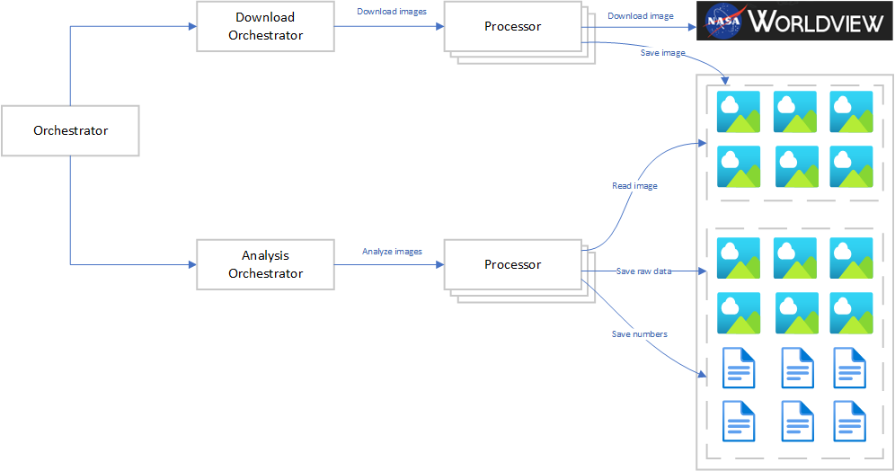

# Clouds
The purpose of the Clouds solution is to analyze cloud converage in satellite images.

This solution is developed as part of the course Computational Physics: Introductory Course at Malmö University in the spring 2021.

## Design overview
The Clouds solution use a staged approach where each stage is controlled by a specialized Orchestrator, and on top of everything there is another Orchestrator that control the specialized Orchestrators.
- Stage 1: Download images from soure on Internet
- Stage 2: Analyze images

The result from each stage is stored as files and can be retrieved for validation and analysis.

## Technologies
Technologies used in this solution are:
- Phyton 
- Azure Containers
- Azure Service Bus
- Azure Blob Storage 
- Linux
- Powershell
- Matlab

## Detailed design
The Clouds solution uses containers to create a large number of simple Processor instances that are controlled by an Orchestrator instance. The Orchestrator use a queue to communicate with the Processors, this both provides a reliable delivery mechanism and an automatic load-balancing between the Processors.

## Functionality in Stage Orchestrator
- Create Service Bus queue to be used to communicatewith Processor instances.
- Create Processor instances.
- Post all command message to the Service Bus queue, they will one-by-one be picked up by Processor instances.
- Monitor message for completed work and check that as done.
- If processing stops while there still are uncompleted message, resubmit them.
- Remove Processor instances.

## Functionality in Processor: Download
- Detect new message arriving in Service Bus queue,
- Read date and coordinates from message,
- Download satellite image file,
- Save image file in Blob Storage,

## Functionality in Processor: Analysis
- Detect new message arriving in Service Bus queue.
- Read date from message.
- Get image file from Blob Storage.
- Perform analysis of clouds in the image.
- Save the resulting cloud overlay image in Blob Storage.
- Save basic data from the image analysis in Blob Storage.
- Post a response message to let the Stage Orchestrator know the message has been successfully processed,

## Implementation details

### Downloading images
Images are downloaded by Processor nodes in the first stage. The command to download the images is received by polling messages from a Service Bus queue, the message has the date that is to be downloaded and the corner coordinates of the area to be downloaded.

The URL below is used to download images fom NASA Worldview, the **bold** parts show where the date an coordinates will be replaced.

https://wvs.earthdata.nasa.gov/api/v1/snapshot?REQUEST=GetSnapshot&LAYERS=MODIS_Terra_CorrectedReflectance_TrueColor,Reference_Features&CRS=EPSG:4326&TIME=**2021-02-16**&WRAP=DAY,X&**BBOX=54.6985,10.3525,69.8203,24.7862**&FORMAT=image/jpeg&WIDTH=1642&HEIGHT=1721&AUTOSCALE=TRUE&ts=1613596146152

### Message from Stage Orchestrator to Processor
The message posted on the queue has the following structure
    <<date to be downloaded>>
    <<latitude for lower left corner>>
    <<longitude for lower left corner>>
    <<latitude for upper right  corner>>
    <<longitude for upper right corner>>

## Message from Processor to Stage Orchestrator
The message posted on the queue has the following structure
    <<date that has been downloaded successfully>>

