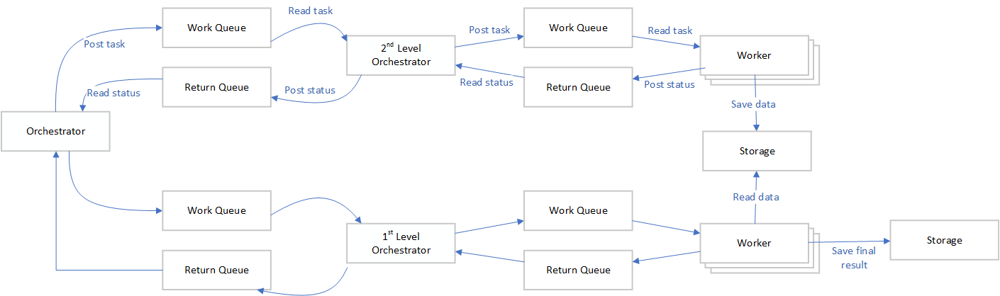

# Antfarm - A framework for parallell execution of tasks
Antfarm is a general purpose framework intended to support parallell execution of tasks. 
It is a design pattern and a reference implementation, in addition there will be a small validation application to verify a deployment
is configured well.

Antfarm is my first attempt at this type of framework and the guiding priciples has been "reduce the problem" and KISS.

Antfarm is NOT intended to be a multi-threaded, GPU-aware, shared-memory or storage optimized framework.

## Overview of the  Design Pattern
In the Antfarm framework everything starts with the first [Orchestrator](terminology.md#orchestrator) in the [Pipeline](terminology.md#pipeline). 
It always initiate work for the next level by posting tasks to the [Work Queue](terminology.md#work-queue), the receiver may by another [Orchestrator](terminology.md#orchestrator) or a [Worker](terminology.md#worker). Results are always communicated back to the initiator using a [Response Queue](terminology.md#response-queue).

## Terminology and Definitions
See [Terminology](terminology.md) to learn about the terminology used in Artfarm.

## Design of Antfarm
To learn about the design of Antfarm please see [Antfarm Design](design.md).

## Reference Implementation
The reference implementation of the Antfarm framework is done in Python and the target environment is Linux containers.

More details are available at [Antfarm Framework Implementation](fx-implementation.md).

## Validating the Reference Implementation
To validate the reference implementation a very simple application will be created that show how to plugin an application into the reference implementation.
